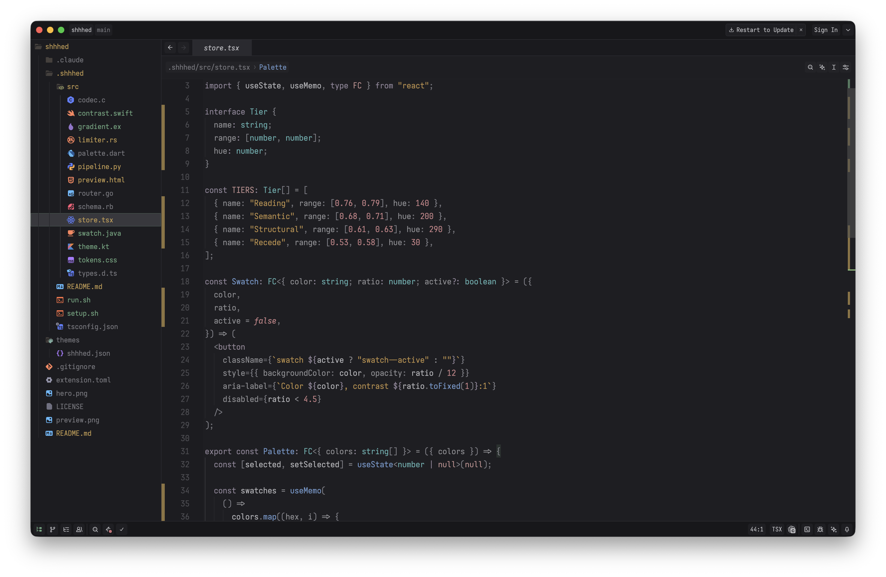
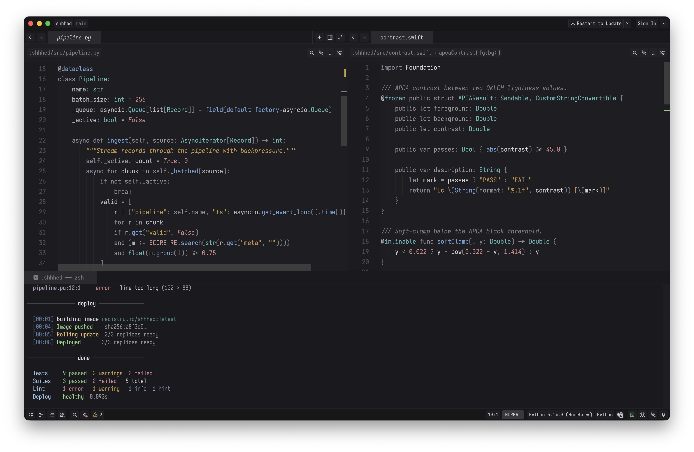
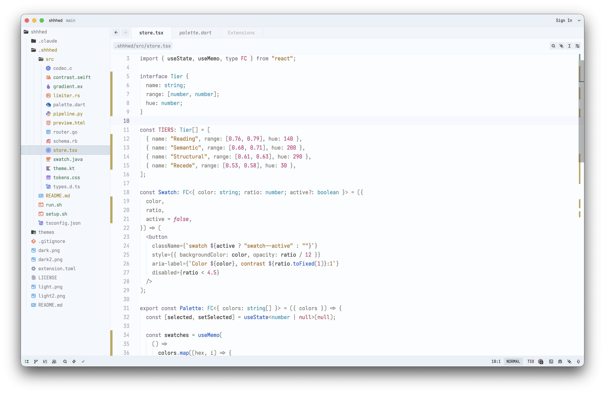
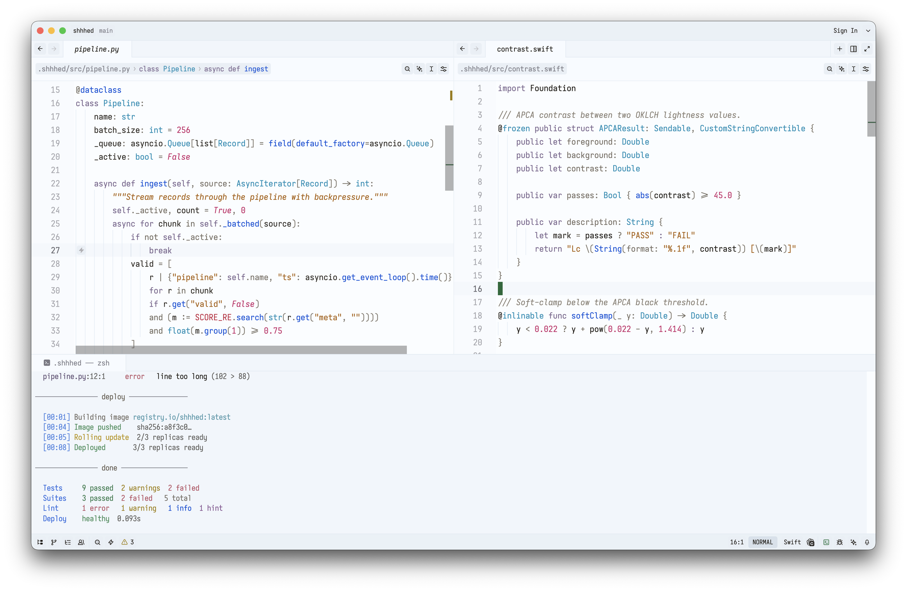

> Font: Iosevka SS14 (JetBrains Mono) 548 · Terminal: Iosevka Term SS10 · Icons: [FantastIcons](https://zed.dev/extensions/fantasticons-icons-theme) · Tip: `"colorize_brackets": false`

# shhhed

A quiet theme for [Zed](https://zed.dev). Scaffolding recedes, meaning emerges.

## Design

Five brightness tiers, assigned by how much each token matters when scanning code:

| Tier | OKLCH L | Examples | Role |
|------|---------|----------|------|
| Canvas | — | Editor  `#1e1e22`, chrome  `#1a1a1e` | Background |
| Recede | 0.56–0.60 | Comments  `#797981`, Punctuation  `#74747a` | Present but not competing |
| Structural | 0.62–0.67 | Operators  `#929296`, Keywords  `#918699`, Attributes / properties / parameters / member vars  `#909094` | Scaffolding |
| Semantic | 0.68–0.71 | Types  `#60b1b1`, Functions  `#729bcf`, Strings  `#c48d2f`, Numbers  `#ca8489` | Meaning |
| Reading | 0.76–0.79 | Variables  `#b8b8bc`, Constructors  `#c6a6be`, Variants  `#c6a6be` | What you're reading |

- Near-neutral canvas with blue undertone. Compatible with Night Shift / f.lux.
- Palette computed in [OKLCH](https://oklch.com). Same-tier tokens differ by hue, not brightness.
- Saturation under 50% HSL (most under 40%) to reduce strain on dark backgrounds.
- Structural tokens clear 4.5:1 against the canvas (WCAG AA). Recede tokens sit at 3.5–4.1:1 — legible but not competing.

## Palette

| Token | Color | Hex |
|-------|-------|-----|
| Types |  | `#60b1b1` |
| Functions |  | `#729bcf` |
| Strings |  | `#c48d2f` |
| Numbers |  | `#ca8489` |
| Keywords |  | `#918699` |
| Background |  | `#1e1e22` |

## Light

Same five tiers, inverted. Cool canvas, gray scaffolding, vivid meaning.

On a dark background, brighter and more colorful both mean "more visible." The eye gets two signals, so small lightness gaps are enough to tell tiers apart.

On a light background, darker and more colorful pull apart: a token can be dark or vivid, but not both. Structural tokens stay dark and neutral; semantic tokens trade some darkness for high chroma so they stand out through color intensity instead.

| Tier | OKLCH L | C | Examples | Role |
|------|---------|---|----------|------|
| Canvas | 0.97 | ~0 | Background  `#f1f6fb` | Background |
| Recede | 0.58–0.60 | 0.01–0.02 | Comments  `#877f73`, Punctuation  `#7f7970` | Present but not competing |
| Structural | 0.51–0.54 | 0.02–0.08 | Keywords  `#715a8b`, Operators  `#726b5f`, Properties  `#756d62` | Scaffolding |
| Semantic | 0.49–0.60 | 0.12–0.22 | Types  `#008cb4`, Functions  `#0050d8`, Strings  `#9c7c00`, Numbers  `#c82868` | Meaning |
| Reading | 0.28–0.41 | 0.01–0.20 | Variables  `#2d2821`, Constructors  `#6a1098` | What you're reading |

- Cool-white canvas (L=0.97) with blue undertone, matching the dark variant.
- Chroma carries the tier signal — semantic tokens pop through color intensity (C=0.12–0.22) against near-neutral structural tokens (C≈0.02).

| Token | Color | Hex | OKLCH |
|-------|-------|-----|-------|
| Types |  | `#008cb4` | L=0.60 C=0.12 H=227 |
| Functions |  | `#0050d8` | L=0.49 C=0.22 H=262 |
| Strings |  | `#9c7c00` | L=0.60 C=0.12 H=91 |
| Numbers |  | `#c82868` | L=0.56 C=0.20 H=3 |
| Keywords |  | `#715a8b` | L=0.51 C=0.08 H=305 |
| Background |  | `#f1f6fb` | L=0.97 C=0.01 H=248 |

## Install

[shhhed](https://zed.dev/extensions/shhhed-theme) in Zed extensions.

## Further reading

- [APCA Contrast Algorithm](https://git.apcacontrast.com/documentation/APCA_in_a_Nutshell.html)
- [OKLCH Color Space](https://oklch.com)
- [Helmholtz–Kohlrausch effect](https://en.wikipedia.org/wiki/Helmholtz%E2%80%93Kohlrausch_effect)
- [Syntax Highlighting Done Right](https://tonsky.me/blog/syntax-highlighting/) — Tonsky

## License

MIT
