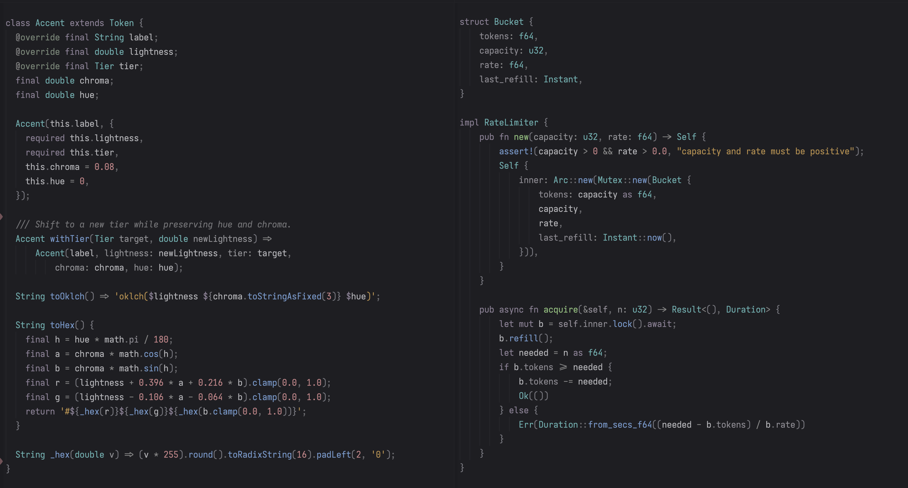
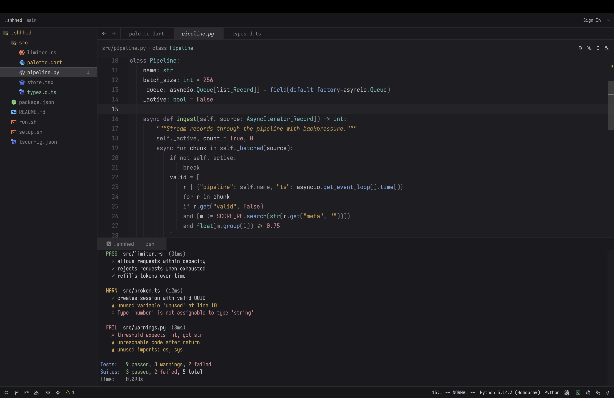

> Font: Iosevka SS14 (JetBrains Mono) 548 · Terminal: Iosevka Term SS10 · Tip: `"colorize_brackets": false`

# shhhed

A quiet theme for [Zed](https://zed.dev). Scaffolding recedes, meaning emerges.

## Design

Five brightness tiers, assigned by how much each token matters when scanning code:

| Tier | OKLCH L | Examples | Role |
|------|---------|----------|------|
| Canvas | — | Editor  `#1e1e22`, chrome  `#1a1a1e` | Background |
| Recede | 0.56–0.60 | Comments  `#797981`, Punctuation  `#74747a` | Present but not competing |
| Structural | 0.62–0.67 | Operators  `#929296`, Keywords  `#918699`, Attributes / properties / parameters / member vars  `#909094` | Scaffolding |
| Semantic | 0.68–0.71 | Types  `#60b1b1`, Functions  `#729bcf`, Strings  `#bd9049`, Numbers  `#ca8489` | Meaning |
| Reading | 0.76–0.79 | Variables  `#b8b8bc`, Constructors  `#c6a6be`, Variants  `#c6a6be` | What you're reading |

- Near-neutral canvas with blue undertone. Compatible with Night Shift / f.lux.
- Palette computed in [OKLCH](https://oklch.com). Same-tier accents differ by hue, not brightness.
- Saturation under 50% HSL (most under 40%) to reduce strain on dark backgrounds.
- Structural tokens clear 4.5:1 against the canvas (WCAG AA). Recede tokens (comments, punctuation, brackets) sit at 3.5–4.1:1 — legible but not competing for reading attention.

## UI

Covers the full Zed surface: git gutter, diffs, search highlights, debugger, minimap, scrollbar, terminal (16-color ANSI + bright/dim), and status colors.

## Palette

| Token | Color | Hex |
|-------|-------|-----|
| Types |  | `#60b1b1` |
| Functions |  | `#729bcf` |
| Strings |  | `#bd9049` |
| Numbers |  | `#ca8489` |
| Keywords |  | `#918699` |
| Background |  | `#1e1e22` |

## Light

Same five tiers, inverted. Cool canvas, gray scaffolding, vivid meaning.

The light variant keeps the same accent families and pushes more chroma into semantic tokens so they cut through the bright background without turning scaffolding into the main event.

| Token | Color | Hex |
|-------|-------|-----|
| Types |  | `#006b89` |
| Functions |  | `#2c3fd0` |
| Strings |  | `#9c7c00` |
| Numbers |  | `#a9134e` |
| Keywords |  | `#5f447d` |
| Background |  | `#f7fbff` |

## Install

[shhhed](https://zed.dev/extensions/shhhed-theme) in Zed extensions.

## Further reading

- [APCA Contrast Algorithm](https://git.apcacontrast.com/documentation/APCA_in_a_Nutshell.html)
- [OKLCH Color Space](https://oklch.com)
- [Helmholtz–Kohlrausch effect](https://en.wikipedia.org/wiki/Helmholtz%E2%80%93Kohlrausch_effect)
- [Syntax Highlighting Done Right](https://tonsky.me/blog/syntax-highlighting/) — Tonsky

## License

MIT
